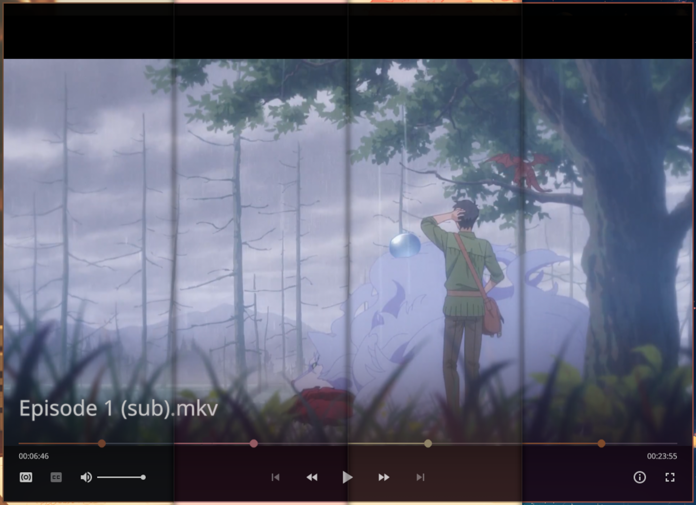

# pywal-mpv-modernx
An MPV OSC script based on [modernx](https://github.com/cyl0/ModernX) that uses the pywal colors as its scheme.



## Installation
> [!warning]
> I have not tested this on windows and macos, also on windows `pywal` does not have specific way to be installed other than `pip` itself. Which means pywal's cache folder path is still not known.

- __On windows__
<br> Locate your MPV folder. It is typically located at `\%APPDATA%\mpv\`, then copy the contents in it.

- __On Linux__
<br> Just run this on your linux terminal:
```bash
  bash -c "$(curl -fsSL https://raw.githubusercontent.com/aKqir24/pywal-mpv-modernx/refs/heads/main/install.sh)"
```

- __Extras__
<br>To enable thumbnails in timeline, install [thumbfast](https://github.com/po5/thumbfast). No other step necessary. And use the [thumbfast-support](https://github.com/aKqir24/pywal-mpv-modernx/tree/thumbfast-support) branch to support thumbfast. But if you used the script it will ask you enabled it or not. 

## Config
edit `osc.conf` in "\~\~/script-opts/" folder, however many options are changed, so refer to the user_opts variable in the script file for details.

## Buttons
like the built-in script, some buttons may accept multiple mouse actions, here is a list:

___Seekbar___
- Left mouse button: seek to chosen position.
- Right mouse button: seek to the head of chosen chapter
  
___Playlist back/forward buttons___
- Left mouse button: play previous/next file.
- Right mouse button: show playlist.
  
___Skip back/forward buttons___
- Left mouse button: go to previous/next chapter.
- Right mouse button: show chapter list.
  
___Jump back/forward buttons___
- Left mouse button: Jumps forwards/backwards by 5 seconds, or by the amount set in `user_opts`.
- Right mouse button: Jumps forwards/backwards by 1 minute.
- Shift + Left mouse button: Skips to the previous/next frame.
  
___Cycle audio/subtitle buttons___
- Left mouse button/Right mouse button: cycle to next/previous track.
- Middle mouse button: show track list.
  
___Playback time___
- Left mouse button: display time in milliseconds
  
___Duration___
- Left mouse button: display total time instead of remaining time
<br>
